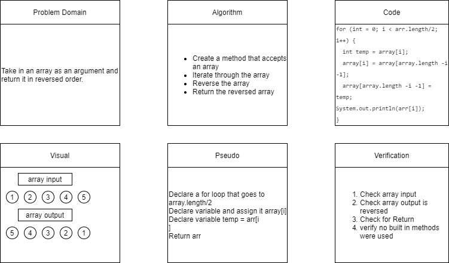

# Reverse an Array
<!-- Short summary or background information -->
Write a function called reverseArray which takes an array as an argument. Without utilizing any of the built-in methods available to your language, return an array with elements in reversed order.

## Collaborators
- Nicholas Carignon

## Citations
- https://www.java67.com/2016/10/3-ways-to-reverse-array-in-java-coding-interview-question.html#:~:text=Reverse%20an%20Array%20using%20ArrayList,the%20element%20in%20linear%20time.
- https://teamtreehouse.com/library/sorting  <!-- Used 1. Reverse a given Array in Place -->

## Challenge
<!-- Description of the challenge -->
- Take in an array
- Reverse the array
- Return the reversed array
- Say no to built-in methods

## Approach & Efficiency
<!-- What approach did you take? Why? What is the Big O space/time for this approach? -->
My approach for this challenge was to take it slow.  I spent a lot of time white boarding and writing out my code on the board before opening VS studio.  As I am just learning Java I started by looking at each individual line to make sure my app was properly setup.  Once I had done all I could in my setup, I moved on to creating the array that I need to iterate over.  I then began looking into sorting the array, I found multiple options but was given the instruction to not use built in Java.  I chose the option that didn't use an import and then got TA(Teacher) assistant to clean up and ask questions about anything I wasn't sure about.
I am trying to make sure I dedicate focus on everything I do instead of speed completion.

## Solution
<!-- Embedded whiteboard image -->
