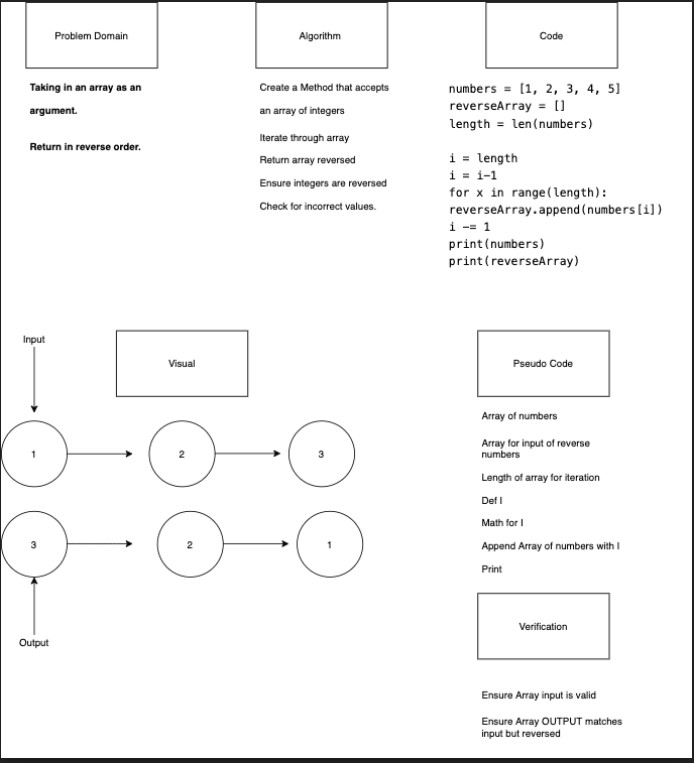

# Reverse an Array
<!-- Description of the challenge -->
White Board Challenge
Create a White Board based on the feature task.

## Feature Tasks
Write a function called reverseArray which takes an array as an argument. Without utilizing any of the built-in methods available to your language, return an array with elements in reversed order.

## Authors
- Glenn Clark
- Anthony Williams

## Collaborators
- Ben Hill (TA)

## Whiteboard Process
<!-- Embedded whiteboard image -->

## Approach & Efficiency
<!-- What approach did you take? Discuss Why. What is the Big O space/time for this approach? -->
