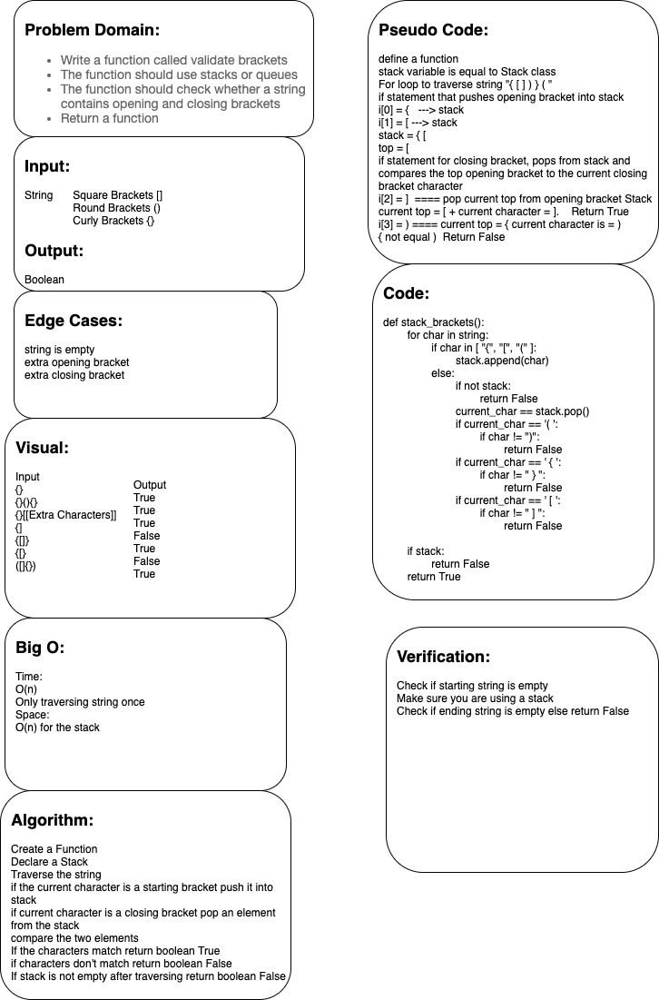

# Challenge Summary
Use a stack to validate brackets in a string

## Whiteboard Process

## Approach & Efficiency
- looped through the string
- pushed opening brackets into a stack
- when finding a closing bracket popped the top bracket out of the stack and compared the two
Time = O(n)
Space = O(n)

## Solution
<!-- Show how to run your code, and examples of it in action -->

## Credits
- https://www.geeksforgeeks.org/check-for-balanced-parentheses-in-an-expression/
