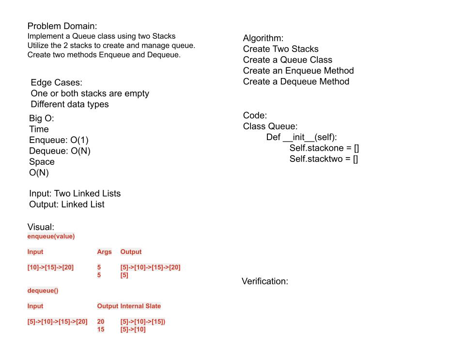

# Challenge Summary
Implement a Queue using two Stacks.

## Author:
Glenn Clark

## Collaborators

## Credits
- https://www.geeksforgeeks.org/queue-using-stacks/

## Whiteboard Process

## Approach & Efficiency
<!-- What approach did you take? Why? What is the Big O space/time for this approach? -->

## Solution
<!-- Show how to run your code, and examples of it in action -->
