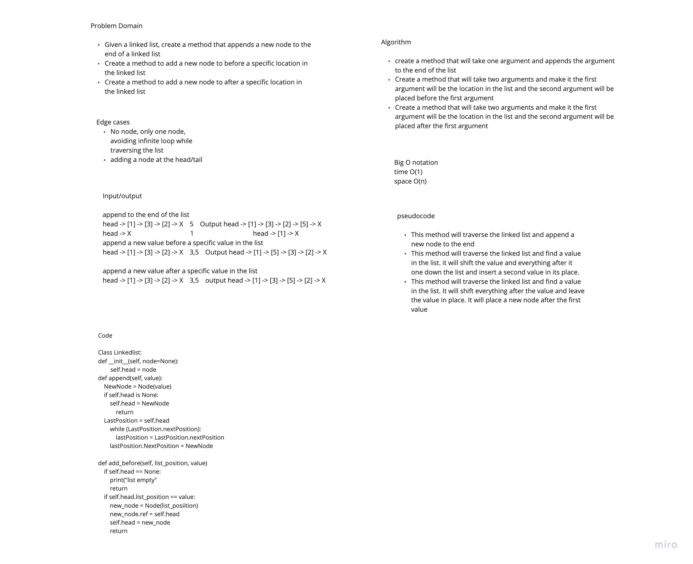
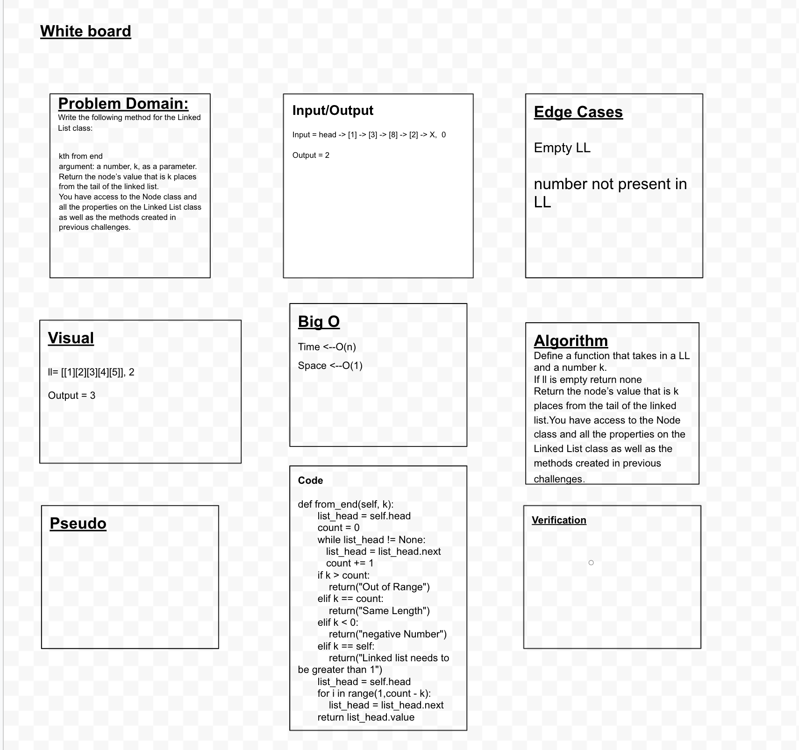
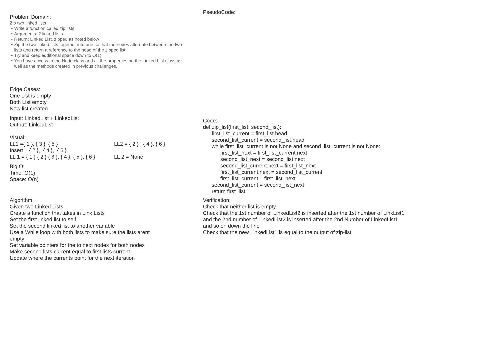

# Singly Linked List
This project uses Python to create a Linked List.  The list can have items added to it as well as use a search function.  The list can also be printed out.

## Challenge
- Create a Node class that has properties for the value stored in the Node, and a pointer to the next Node.
- Within your LinkedList class, include a head property. Upon instantiation, an empty Linked List should be created.
- Define a method called insert which takes any value as an argument and adds a new node with that value to the head of the list with an O(1) Time performance.
- Define a method called includes which takes any value as an argument and returns a boolean result depending on whether that value exists as a Node’s value somewhere within the list.
- Define a method called toString (or __str__ in Python) which takes in no arguments and returns a string representing all the values in the Linked List, formatted as:
"{ a } -> { b } -> { c } -> NULL"
- Any exceptions or errors that come from your code should be semantic, capturable errors. For example, rather than a default error thrown by your language, your code should raise/throw a custom, semantic error that describes what went wrong in calling the methods you wrote for this lab.
- Be sure to follow your language/frameworks standard naming conventions (e.g. C# uses PascalCasing for all method and class names).

## Approach & Efficiency
<!-- What approach did you take? Why? What is the Big O space/time for this approach? -->

## White Board

## API
<!-- Description of each method publicly available to your Linked List -->

## Credits and Collaborators
- Prabin Singh
- Garfield Grant
- Wondwusen
- Matt Santorsola
- https://www.geeksforgeeks.org/merge-a-linked-list-into-another-linked-list-at-alternate-positions/
